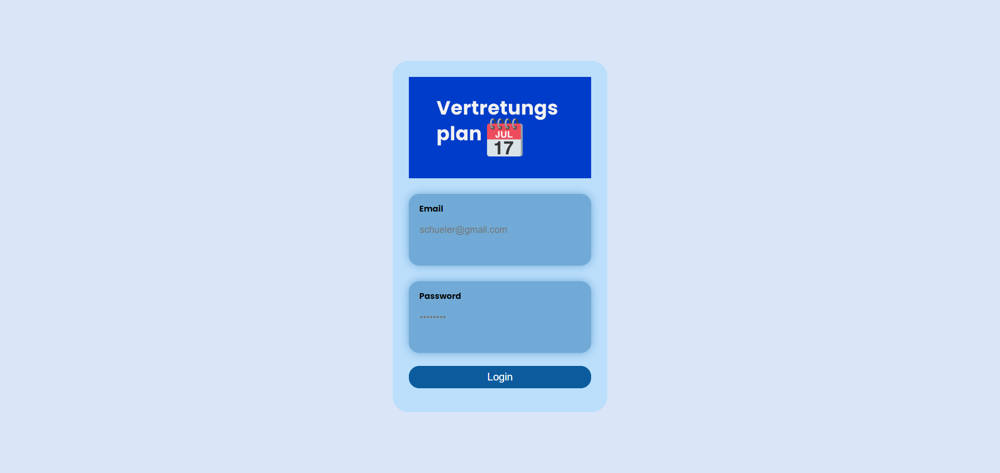
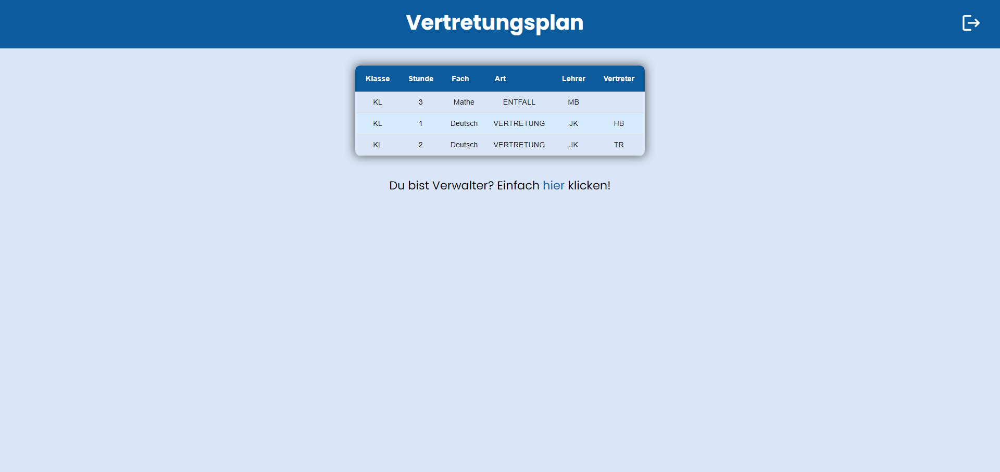
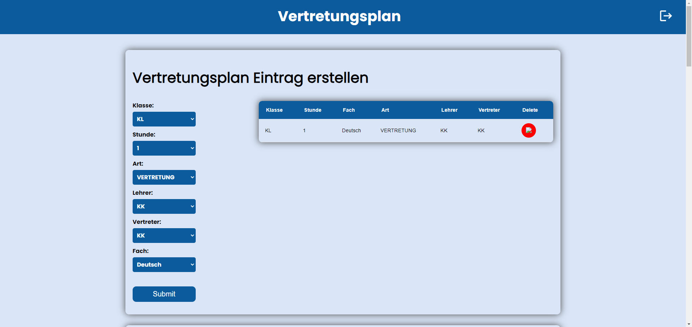
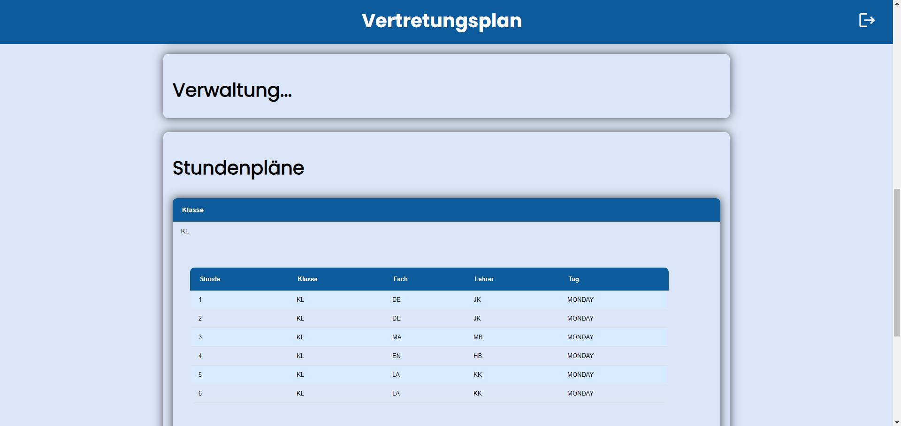
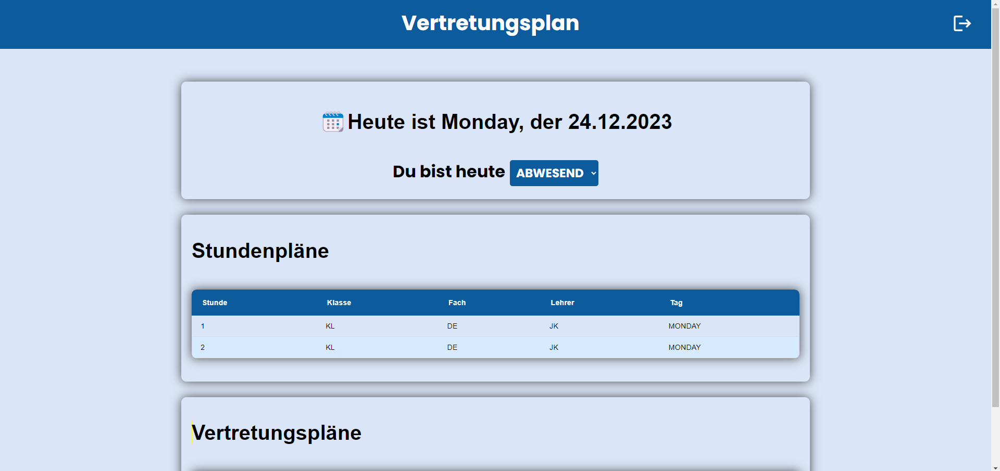

<h1 align="center">Vertretungsplan</h1>
<h3 align="center">A smarter substitution plan!</h2>

    <h4 align="center">Developed with the software and tools below</h4>
    

        
        
        
        
        
        
        
        
        
        
        
        
    

Introducing a comprehensive substitution plan application featuring a Spring Boot Backend and a Vite-built Vanilla JS/HTML/CSS Frontend. The primary goal of this application is to address the issues commonly associated with slow substitution plan apps. It achieves this by employing an algorithm that automatically generates entries based on relevant data.

## Motivation

I embarked on this project a year ago due to the occasional sluggishness of our current substitution plan, often displaying changes late, catching students off guard upon reaching school. This application aims to eliminate this issue by automating the creation of substitution plan entries.

## Usage

The application is equipped with preset data and serves as a "proof-of-concept." It does not offer a dashboard or endpoints for creating or editing individual entities. Users can log in using one of the preconfigured accounts, with the password **vertretungspaln** (Note: This is not secure for production but sufficient for a proof-of-concept application). Each account is assigned one of three roles. The teacher account holds the **TEACHER** role, granting the ability to manage the account and access a teacher-specific page. This page is exclusively available to accounts with the teacher role. The **STUDENT** role is designed for students, enabling them to view the substitution plan. Lastly, the **ADMINISTRATOR** role provides admin privileges to manage/view the entire system's data and manually create/delete substitution plan entries.

### Students

| Name      | Email                     |
| --------- | ------------------------- |
| student0  | student0@gmail.com  |
| ...       | ...                       |
| student49 | student49@gmail.com |

### Teachers

| Name             | Email                                   |
| ---------------- | --------------------------------------- |
| Juliane Köppen   | juliane.köppen@gmail.com   |
| Martin Brauren   | martin.brauren@gmail.com   |
| Yannick Herbrich | yannick.herbrich@gmail.com |
| Karla Kurzawa    | karla.kurzawa@gmail.com    |
| Hildegard Bätz   | hildegard.bätz@gmail.com   |
| Till Redl        | till.redl@gmail.com        |

&#8594; These names don't try to impersonate real people and were generated using https://realnamecreator.alexjonas.de/?l=de

### Administrator

| Name          | Email                                |
| ------------- | ------------------------------------ |
| Administrator | administrator@gmail.com |

## Setup

To set up this project follow the setup guides in the

- [Server Readme](vertretungsplan-server/README.md#getting-started)
- [Client Readme](vertretungsplan-client/README.md#getting-started)

It's important to first set up the server, or at least be able to successfully run it, for the client to fully work, since it relies on the server for the data.

## Screenshots

